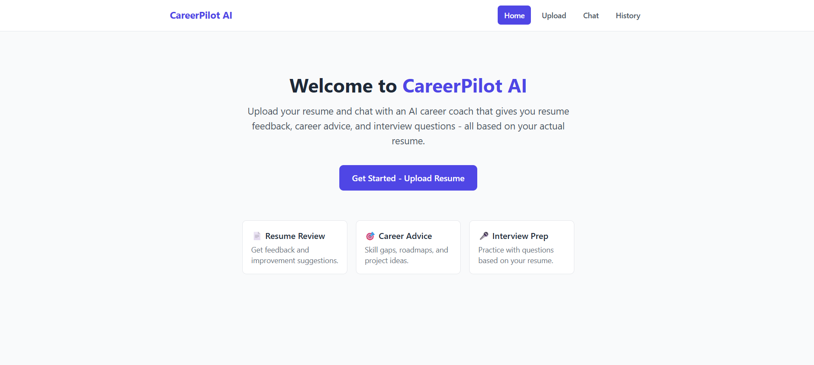
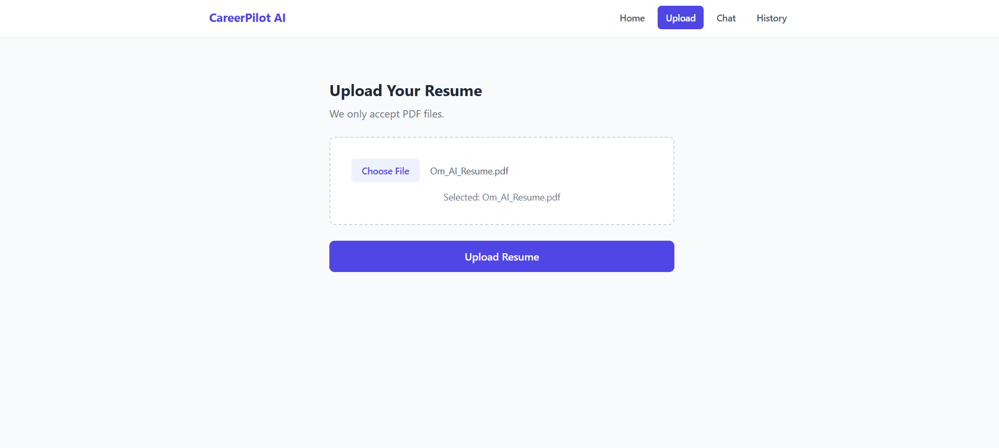
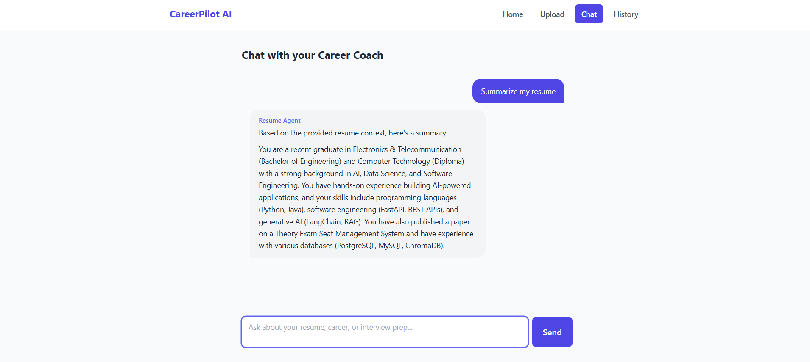

<div align="center">

# 🚀 CareerPilot AI

### **AI-Powered Resume & Career Coach**

Upload your resume and interact with an AI assistant that provides personalized career guidance, resume insights, interview preparation, and job-related recommendations using **Retrieval-Augmented Generation (RAG)** and **LangGraph multi-agent orchestration**.

<p>
  
  
  
  
  
  
</p>

**React • FastAPI • LangGraph • LangChain • ChromaDB • HuggingFace Embeddings • Groq**

</div>

---

# 📖 Overview

CareerPilot AI is a full-stack AI application that enables users to upload their resume and receive personalized career guidance through an intelligent conversational interface. The system uses **Retrieval-Augmented Generation (RAG)** and a **LangGraph multi-agent workflow** to ensure responses are grounded in the uploaded resume rather than relying solely on the language model.

The application routes user questions to specialized AI agents for resume analysis, career guidance, or interview preparation, providing accurate, context-aware answers tailored to the user's experience and skills.

---

# ✨ Features

- 📄 Upload Resume (PDF)
- 🤖 AI Resume Analysis
- 💼 Personalized Career Guidance
- 🎯 Interview Preparation Assistant
- 🧠 Multi-Agent Workflow using LangGraph
- 🔍 Retrieval-Augmented Generation (RAG)
- 📚 Semantic Resume Search
- 💬 Context-Aware AI Chat
- ⚡ Responsive React Interface
- 📝 Markdown-Supported Responses

---

# 🛠 Tech Stack

| Frontend | Backend | AI | Storage |
|-----------|-----------|-----------|-----------|
| React (Vite) | FastAPI | LangChain | ChromaDB |
| Tailwind CSS | Python | LangGraph | Local Storage |
| Axios | Pydantic | Groq API | |
| React Router | Uvicorn | HuggingFace Embeddings | |

---

# 🏛 System Architecture

```text
                  Resume PDF Upload
                          │
                          ▼
              PyMuPDF Text Extraction
                          │
                          ▼
              Chunking & Embedding
                          │
                          ▼
            HuggingFace Embeddings
                          │
                          ▼
                  ChromaDB Storage
                          │
                          ▼
                   User Question
                          │
                          ▼
                LangGraph Router
                          │
          ┌───────────────┼────────────────┐
          ▼               ▼                ▼
   Resume Agent    Career Agent    Interview Agent
          │               │                │
          └───────────────┼────────────────┘
                          ▼
                  Groq Large Language Model
                          │
                          ▼
                  Context-Aware Response
```

---

# 📸 Screenshots

Replace these placeholders with your application screenshots.

## 🏠 Home



---

## 📄 Resume Upload



---

## 💬 AI Chat



---

# ⚙ Installation

## Clone Repository

```bash
git clone https://github.com/yourusername/CareerPilot-AI.git

cd CareerPilot-AI
```

---

## Backend Setup

```bash
cd backend

python -m venv venv

# Windows
venv\Scripts\activate

# Linux / macOS
source venv/bin/activate

pip install -r requirements.txt
```

Create a `.env`

```env
GROQ_API_KEY=your_groq_api_key
```

Run Backend

```bash
uvicorn app.main:app --reload
```

Backend

```
http://localhost:8000
```

Swagger Documentation

```
http://localhost:8000/docs
```

---

## Frontend Setup

```bash
cd frontend

npm install

npm run dev
```

Frontend

```
http://localhost:5173
```

---

# 🧠 LangGraph Workflow

```text
                  User Question
                        │
                        ▼
              LangGraph Router Node
                        │
        ┌───────────────┼───────────────┐
        ▼               ▼               ▼
 Resume Agent    Career Agent    Interview Agent
        │               │               │
        └───────────────┼───────────────┘
                        ▼
               Resume Retrieval (RAG)
                        │
                        ▼
                    Groq LLM
                        │
                        ▼
               Personalized Response
```

